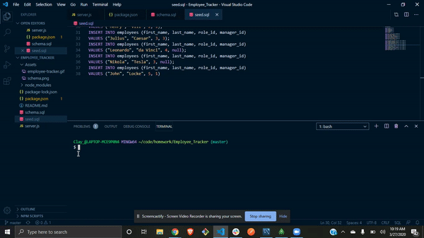
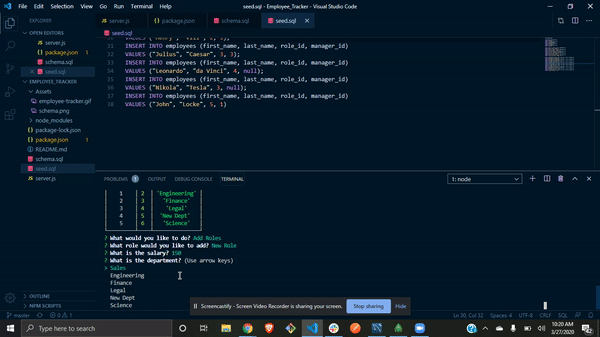

# Employee_Tracker



---------------------------------------



### Description
```
Utilizing NodeJS, inquirer and MYSQL to form a employee logging system capable of getting data from database as well as posting new data, updating preexisting data, and removing the insertions from the table completely
```
